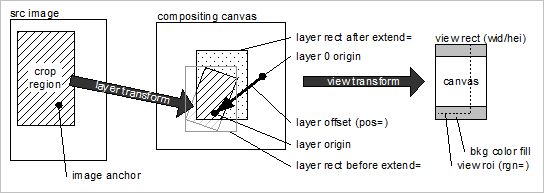

# Posizionamento livello{#layer-placement}

I livelli vengono posizionati allineando l&#39;origine del livello (origin=) con l&#39;origine del livello di sfondo a un offset specificato da pos=.

Se l’origine del livello non è specificata esplicitamente per un livello immagine, viene calcolata come segue:

1. Determinare l’ancoraggio dell’immagine. Utilizzare `anchor=` o, se non specificato, `catalog::Anchor`.
1. Se è definito l’ancoraggio dell’immagine, applica le trasformazioni di livello e `extend=` per convertirlo in un valore origin= .
1. Se non è definito alcun ancoraggio immagine, l’origine del livello viene posizionata al centro del rettangolo del livello (dopo l’applicazione di `extend=`).

