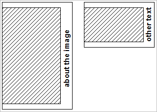

# Esempio B{#example-b}

Requisiti simili all&#39;esempio A, ma utilizzare uno sfondo a colori solidi e consentire la variazione dell&#39;altezza del composito per adattarsi alle immagini con proporzioni diverse.

<table id="simpletable_37BA3B2A75A9468C9ADEBBC034BADAE7"> 
 <tr class="strow"> 
  <td class="stentry"> 
 catalogo::Id 
 </td> 
  <td class="stentry"> 
 catalogo::Modificatore 
</td> 
 </tr> 
 <tr class="strow"> 
  <td class="stentry"> 
 myTemplate2 
</td> 
  <td class="stentry"> 
 $text=layer+1+text+go+here&amp; layer=0&amp;size=800,0&amp;extension=0,100,200,100&amp;src=$object$&amp;originN=.5,0&amp; layer=1&amp;text=rtf..$text$..rtf-encoding&amp;rotate=-90&amp;originorigin=.5,0&amp;posN=0.5,0 
</td> 
 </tr> 
</table>

L&#39;immagine viene posizionata nel livello 0 e il valore di altezza di `size=` è impostato su 0, il che determina l&#39;altezza effettiva in base all&#39;altezza dell&#39;immagine dopo averla ridimensionata a 800 pixel di larghezza.

`extend=` aggiunge 100 pixel in alto e in basso e 200 pixel a destra.

Le origini del livello 0 e del livello 1 vengono posizionate al centro a destra dell&#39;area di composizione, in modo da ottenere la posizione del testo desiderata.

L&#39;illustrazione seguente mostra il risultato composito per diverse proporzioni dell&#39;immagine e diverse stringhe di testo.

