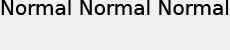

# Posizionamento del testo{#text-positioning}

Il modulo di rendering text= posiziona il testo in modo fondamentalmente diverso dal modulo di rendering textPs= quando viene applicato a livelli predefiniti (ovvero quando è specificato anche size=).

I livelli di ridimensionamento `text=`e `textPs=` hanno aspetto e posizionamento simili.

`textPs=` allinea la parte superiore della cella di carattere con la parte superiore della casella di testo (supponendo  `\vertalt`), anche se questo determina l’estensione parziale di parti dei glifi di testo sottoposti a rendering al di fuori del bordo della casella di testo. Anche i glifi sottoposti a rendering di determinati font possono sporgere leggermente oltre i bordi sinistro e destro della casella di testo. Per le applicazioni che richiedono che tutto il testo sottoposto a rendering sia contenuto all&#39;interno del rettangolo di livello, è possibile utilizzare i comandi RTF `\marg*` o `textFlowPath=` per regolare l&#39;area di rendering del testo.

Al contrario, `text=` sposterà il testo sottoposto a rendering in base alle esigenze e garantirà che tutti i glifi sottoposti a rendering rientrino completamente nella casella di testo specificata.

Mentre `text=` può essere un po&#39; più facile da usare per le applicazioni semplici, `textPs=` offre un posizionamento preciso indipendente dalle facce di font e dagli effetti di testo.

## Esempi {#section-1b6bdf2ea34447528188ae4e1430ee71}

Gli esempi seguenti sono relativi al testo di dimensioni predefinite. Il comportamento per il ridimensionamento automatico del testo è diverso.

** `Text=` fornisce sempre un margine stretto nella parte superiore:**

`/is/image/?size=230,50&bgc=f0f0f0&fmt=png&text=\fs40Normal%20Normal%20Normal`

** `textPs=` esegue il rendering del testo allineato rigorosamente nella parte superiore della casella di testo, il che potrebbe causare lievi ritagli, anche per i font comuni come Arial:**

`/is/image/?size=230,50&bgc=f0f0f0&fmt=png&textPs=\fs40Normal%20Normal%20Normal`

** `text=` sposta automaticamente il testo di cui è stato effettuato il rendering verso il basso per evitare il ritaglio:**

`/is/image?size=230,50&bgc=f0f0f0&fmt=png&text=\fs40Normal%20{\up20Raised%20}Normal`

** `textPs=` non sposta il testo contenente parti alzate, con conseguente ritaglio significativo se il testo è sul livello 0:**

`/is/image?size=230,50&bgc=f0f0f0&fmt=png&textPs=\fs40Normal%20{\up20Raised%20}Normal`

**Un margine di 10 pt (200 twip) in alto esegue il rendering di questo testo senza ritaglio:**

`/is/image?size=230,50&bgc=f0f0f0&fmt=png&textPs=\margt200\fs40Normal%20{\up20Raised}%20Normal`

**I glifi sottoposti a rendering di alcuni font di script possono estendersi in modo significativo al di fuori della casella di testo:**

`/is/image?size=230,50&bgc=f0f0f0&fmt=png&textPs={\fonttbl{\f1\fcharset0%20FluffyFont;}}\f1\fs88%20fluffy%20font%20problems`
