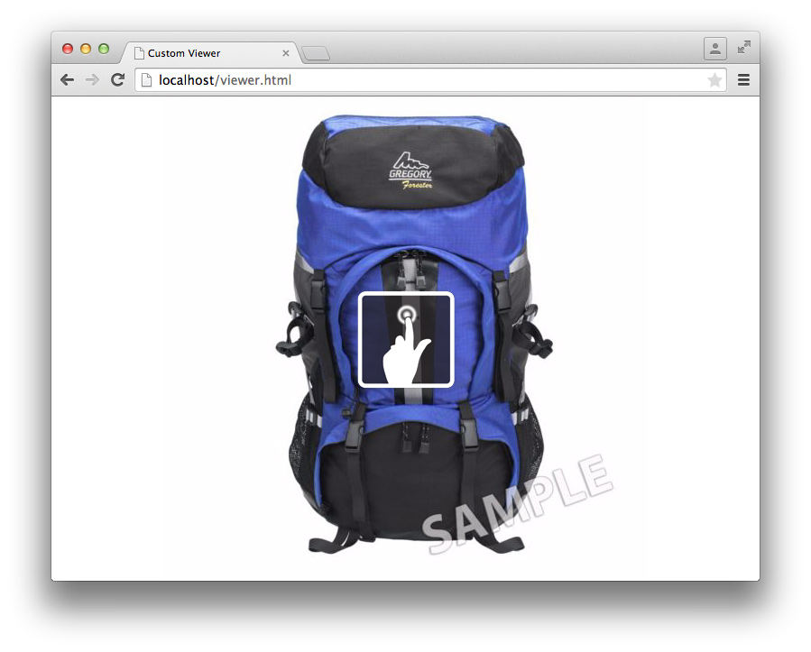

# Tutorial SDK per visualizzatori{#viewer-sdk-tutorial}

L’SDK per visualizzatori fornisce un set di componenti basati su JavaScript per lo sviluppo di visualizzatori personalizzati. I visualizzatori sono applicazioni basate sul web che consentono di incorporare contenuti rich media serviti da Adobe Dynamic Media nelle pagine web.

Ad esempio, l’SDK fornisce funzioni interattive di zoom e panoramica. Offre inoltre la visualizzazione a 360° e la riproduzione video delle risorse caricate su Adobe Dynamic Media tramite l’applicazione back-end Dynamic Media Classic.

Anche se i componenti si basano sulla funzionalità HTML5, sono progettati per funzionare su dispositivi e desktop Android e Apple iOS, inclusi Internet Explorer e versioni successive. Questo tipo di esperienza significa che puoi fornire un unico flusso di lavoro per tutte le piattaforme supportate.

L’SDK è costituito dai componenti dell’interfaccia utente che compongono il contenuto del visualizzatore. Puoi assegnare uno stile a questi componenti tramite CSS e componenti non dell’interfaccia utente con un certo tipo di ruolo di supporto, ad esempio il recupero e l’analisi o il tracciamento delle definizioni dei set. Tutti i comportamenti dei componenti sono personalizzabili tramite modificatori che puoi specificare in diversi modi, ad esempio come coppie `name=value` nell’URL.

Questa esercitazione include il seguente ordine di attività per creare un visualizzatore zoom di base:

* [Scarica l’SDK del visualizzatore più recente da Adobe Developer Connection](c-tutorial.md#section-84dc74c9d8e24a2380b6cf8fc28d7127)
* [Caricare l’SDK del visualizzatore](c-tutorial.md#section-98596c276faf4cf79ccf558a9f4432c6)
* [Aggiunta di stile al visualizzatore](c-tutorial.md#section-3783125360a1425eae5a5a334867cc32)
* [Incluso contenitore e visualizzazione zoom](c-tutorial.md#section-1a01730663154a508b88cc40c6f35539)
* [Aggiunta di componenti MediaSet e Campioni al visualizzatore](c-tutorial.md#section-02b8c21dd842400e83eae2a48ec265b7)
* [Aggiunta di pulsanti al visualizzatore](c-tutorial.md#section-1fc334fa0d2b47eb9cdad461725c07be)
* [Configurazione verticale dei campioni](c-tutorial.md#section-91a8829d5b5a4d45a35b7faeb097fcc9)

## Scarica l’SDK del visualizzatore più recente da Adobe Developer Connection {#section-84dc74c9d8e24a2380b6cf8fc28d7127}

1. Scarica l’SDK del visualizzatore più recente da Adobe Developer Connection <!-- SDK NO LONGER AVAILABLE TO DOWNLOAD;DOUBLE CHECK WITH AMIT. THIS ENTIRE TOPIC IS LIKELY OBSOLETE. [here](https://marketing.adobe.com/developer/devcenter/scene7/show) -->.

   >[!NOTE]
   >
   >Puoi completare questa esercitazione senza dover scaricare il pacchetto SDK per visualizzatori, in quanto l’SDK viene caricato in remoto. Tuttavia, il pacchetto Visualizzatore include ulteriori esempi e una guida di riferimento API che sarà utile quando crei i tuoi visualizzatori.

## Caricare l’SDK del visualizzatore {#section-98596c276faf4cf79ccf558a9f4432c6}

1. Per iniziare, crea una nuova pagina per sviluppare il visualizzatore zoom di base che stai per creare.

   Considera questo il codice bootstrap (o loader) per impostare un&#39;applicazione SDK vuota. Apri l’editor di testo preferito e incolla il seguente codice HTML:

   ```
   <!DOCTYPE html> 
   <html> 
       <head> 
           <meta http-equiv="Content-Type" content="text/html; charset=utf-8" /> 
           <meta name="viewport" content="user-scalable=no, height=device-height, width=device-width, initial-scale=1.0, maximum-scale=1.0"/> 
   
           <!-- Hiding the Safari on iPhone OS UI components --> 
           <meta name="apple-mobile-web-app-capable" content="yes"/> 
           <meta name="apple-mobile-web-app-status-bar-style" content="black"/> 
           <meta name="apple-touch-fullscreen" content="no"/> 
   
           <title>Custom Viewer</title> 
   
           <!-- 
               Include Utils.js before you use any of the SDK components. This file  
               contains SDK utilities and global functions that are used to initialize the viewer and load viewer  
               components. The path to the Utils.js determines which version of the SDK that the viewer uses. You  
               can use a relative path if the viewer is deployed on one of the Adobe Dynamic Media servers and it is served  
               from the same domain. Otherwise, specify a full path to one of Adobe Dynamic Media servers that have the SDK  
               installed.  
           --> 
           <script language="javascript" type="text/javascript"      
                   src="http://s7d1.scene7.com/s7sdk/2.8/js/s7sdk/utils/Utils.js"></script> 
   
       </head> 
       <body> 
           <script language="javascript" type="text/javascript"> 
           </script>  
       </body> 
   </html>
   ```

   Aggiungi il seguente codice JavaScript all&#39;interno del tag `script` per inizializzare `ParameterManager`. Questo aiuta a preparare la creazione e l&#39;istanziazione di componenti SDK all&#39;interno della funzione `initViewer` :

   ```
   /* We create a self-running anonymous function to encapsulate variable scope. Placing code inside such 
      a function is optional, but this prevents variables from polluting the global object.  */ 
   (function () { 
   
       // Initialize the SDK   
       s7sdk.Util.init(); 
   
       /* Create an instance of the ParameterManager component to collect components' configuration 
          that can come from a viewer preset, URL, or the HTML page itself. The ParameterManager  
          component also sends a notification s7sdk.Event.SDK_READY when all needed files are loaded 
          and the configuration parameters are processed. The other components should never be initialized 
          outside this handler. After defining the handler for the s7sdk.Event.SDK_READY event, it 
          is safe to initiate configuration initialization by calling ParameterManager.init(). */ 
       var params = new s7sdk.ParameterManager(); 
   
       /* Event handler for s7sdk.Event.SDK_READY dispatched by ParameterManager to initialize various components of  
          this viewer. */ 
       function initViewer() { 
   
       }  
   
       /* Add event handler for the s7sdk.Event.SDK_READY event dispatched by the ParameterManager when all modifiers 
          are processed and it is safe to initialize the viewer. */ 
       params.addEventListener(s7sdk.Event.SDK_READY, initViewer, false); 
   
       /* Initiate configuration initialization of ParameterManager. */ 
       params.init(); 
   
   }());
   ```

1. Salva il file come modello vuoto. Puoi utilizzare qualsiasi nome file desiderato.

   Utilizzerai questo file modello vuoto come riferimento quando creerai nuovi visualizzatori in futuro. Questo modello funziona localmente e quando viene servito da un server web.

Ora aggiungi stile al visualizzatore.

## Aggiunta di stile al visualizzatore {#section-3783125360a1425eae5a5a334867cc32}

1. Per questo visualizzatore a pagina intera che stai creando, puoi aggiungere alcuni stili di base.

   Aggiungi il seguente blocco `style` nella parte inferiore del `head`:

   ```
   <style> 
       html, body { 
           width: 100%; 
           height: 100%; 
       } 
       body { 
           /* Remove any padding and margin around the edges of the browser window */ 
           padding: 0; 
           margin: 0; 
   
           /* We set overflow to hidden so that scroll bars do not flicker when resizing the window */ 
           overflow: hidden; 
       } 
   </style>
   ```

Ora verranno inclusi i componenti `Container` e `ZoomView`.

## Incluso contenitore e visualizzazione zoom {#section-1a01730663154a508b88cc40c6f35539}

1. Crea un visualizzatore effettivo includendo i componenti `Container` e `ZoomView`.

   Inserisci le seguenti istruzioni `include` nella parte inferiore dell&#39;elemento `<head>` dopo il caricamento dello script [!DNL Utils.js]:

   ```
   <!-- 
       Add an "include" statement with a related module for each component that is needed for that particular  
       viewer. Check API documentation to see a complete list of components and their modules. 
   --> 
   <script language="javascript" type="text/javascript"> 
       s7sdk.Util.lib.include('s7sdk.common.Container');  
       s7sdk.Util.lib.include('s7sdk.image.ZoomView');  
   </script>
   ```

1. Ora crea le variabili per fare riferimento ai vari componenti SDK.

   Aggiungi le seguenti variabili all&#39;inizio della funzione anonima principale, appena sopra `s7sdk.Util.init()`:

   ```
   var container, zoomView;
   ```

1. Inserisci quanto segue all’interno della funzione `initViewer` per definire alcuni modificatori e creare un’istanza dei rispettivi componenti:

   ```
   /* Modifiers can be added directly to ParameterManager instance */ 
   params.push("serverurl", "http://s7d1.scene7.com/is/image"); 
   params.push("asset", "Scene7SharedAssets/ImageSet-Views-Sample"); 
   
   /* Create a viewer container as a parent component for other user interface components that  
      are part of the viewer application and associate event handlers for resize and  
      full screen notification. The advantage of using Container as the parent is the  
      component's ability to resize and bring itself and its children to full screen. */ 
   container = new s7sdk.common.Container(null, params, "s7container"); 
   container.addEventListener(s7sdk.event.ResizeEvent.COMPONENT_RESIZE, containerResize, false); 
   
   /* Create ZoomView component */ 
   zoomView = new s7sdk.image.ZoomView("s7container", params, "myZoomView");  
   
   /* We call this to ensure all SDK components are scaled to initial conditions when viewer loads */ 
   resizeViewer(container.getWidth(), container.getHeight());
   ```

1. Affinché il codice di cui sopra venga eseguito correttamente, aggiungi un gestore di eventi `containerResize` e una funzione helper:

   ```
   /* Event handler for s7sdk.event.ResizeEvent.COMPONENT_RESIZE events dispatched by Container to resize 
      various view components included in this viewer. */ 
   function containerResize(event) { 
       resizeViewer(event.s7event.w, event.s7event.h); 
   } 
   
   /* Resize viewer components */ 
   function resizeViewer(width, height) { 
       zoomView.resize(width, height); 
   }
   ```

1. Visualizza l’anteprima della pagina per visualizzare gli elementi creati. La pagina avrà un aspetto simile al seguente:

   

Ora aggiungerai i componenti `MediaSet` e `Swatches` al visualizzatore.

## Aggiunta di componenti MediaSet e Campioni al visualizzatore {#section-02b8c21dd842400e83eae2a48ec265b7}

1. Per consentire agli utenti di selezionare le immagini da un set, puoi aggiungere i componenti `MediaSet` e `Swatches`.

   Aggiungi i seguenti SDK:

   ```
   s7sdk.Util.lib.include('s7sdk.set.MediaSet'); 
   s7sdk.Util.lib.include('s7sdk.set.Swatches');
   ```

1. Aggiorna l&#39;elenco delle variabili con quanto segue:

   ```
   var mediaSet, container, zoomView, swatches;
   ```

1. Crea un&#39;istanza dei componenti `MediaSet` e `Swatches` all&#39;interno della funzione `initViewer` .

   Assicurati di creare un&#39;istanza dell&#39;istanza `Swatches` dopo i componenti `ZoomView` e `Container`, altrimenti l&#39;ordine di sovrapposizione nasconde l&#39; `Swatches`:

   ```
   // Create MediaSet to manage assets and add event listener to the NOTF_SET_PARSED event 
   mediaSet = new s7sdk.set.MediaSet(null, params, "mediaSet"); 
   
   // Add MediaSet event listener 
   mediaSet.addEventListener(s7sdk.event.AssetEvent.NOTF_SET_PARSED, onSetParsed, false); 
   
   /* create Swatches component and associate event handler for swatch selection notification */ 
   swatches = new s7sdk.set.Swatches("s7container", params, "mySwatches");   
   swatches.addEventListener(s7sdk.event.AssetEvent.SWATCH_SELECTED_EVENT, swatchSelected, false);
   ```

1. Aggiungi ora le seguenti funzioni del gestore di eventi:

   ```
   /* Event handler for the s7sdk.event.AssetEvent.NOTF_SET_PARSED event dispatched by MediaSet to 
      assign the asset to the Swatches when parsing is complete. */ 
   function onSetParsed(e) { 
   
       // set media set for Swatches to display  
       var mediasetDesc = e.s7event.asset;  
       swatches.setMediaSet(mediasetDesc); 
   
       // select the first swatch by default  
       swatches.selectSwatch(0, true);      
   } 
   
   /* Event handler for s7sdk.event.AssetEvent.SWATCH_SELECTED_EVENT events dispatched by Swatches to switch 
      the image in the ZoomView when a different swatch is selected. */ 
   function swatchSelected(event) {     
       zoomView.setItem(event.s7event.asset);  
   }
   ```

1. Posiziona i campioni nella parte inferiore del visualizzatore aggiungendo il seguente CSS all’elemento `style` :

   ```
   /* Align swatches to bottom of viewer */ 
   .s7swatches { 
       bottom: 0; 
       left: 0; 
       right: 0; 
       height: 150px; 
   }
   ```

1. Visualizza l’anteprima del visualizzatore.

   I campioni si trovano nella parte inferiore sinistra del visualizzatore. Per fare in modo che i campioni abbiano l’intera larghezza del visualizzatore, aggiungi una chiamata per ridimensionare manualmente i campioni ogni volta che l’utente ridimensiona il proprio browser. Aggiungi quanto segue alla funzione `resizeViewer` :

   ```
   swatches.resize(width, swatches.getHeight());
   ```

   Il visualizzatore ora si presenta come la seguente immagine. Prova a ridimensionare la finestra del browser del visualizzatore e osserva il comportamento risultante.

   

Ora è possibile aggiungere pulsanti di zoom in, zoom out e di ripristino dello zoom al visualizzatore.

## Aggiunta di pulsanti al visualizzatore {#section-1fc334fa0d2b47eb9cdad461725c07be}

1. Attualmente, l’utente può effettuare lo zoom solo con gesti di clic o touch. Pertanto, aggiungete alcuni pulsanti di controllo dello zoom di base al visualizzatore.

   Aggiungi i seguenti componenti pulsante:

   ```
   s7sdk.Util.lib.include('s7sdk.common.Button');
   ```

1. Aggiorna l&#39;elenco delle variabili con quanto segue:

   ```
   var mediaSet, container, zoomView, swatches, zoomInButton, zoomOutButton, zoomResetButton;
   ```

1. Crea un&#39;istanza dei pulsanti nella parte inferiore della funzione `initViewer` .

   Ricorda che l’ordine è importante, a meno che tu non specifichi il valore `z-index` in CSS:

   ```
   /* Create Zoom In, Zoom Out and Zoom Reset buttons */ 
   zoomInButton  = new s7sdk.common.ZoomInButton("s7container", params, "zoomInBtn"); 
   zoomOutButton = new s7sdk.common.ZoomOutButton("s7container", params, "zoomOutBtn"); 
   zoomResetButton = new s7sdk.common.ZoomResetButton("s7container", params, "zoomResetBtn"); 
   
   /* Add handlers for zoom in, zoom out and zoom reset buttons inline. */ 
   zoomInButton.addEventListener("click", function() { zoomView.zoomIn(); }); 
   zoomOutButton.addEventListener("click", function() { zoomView.zoomOut(); }); 
   zoomResetButton.addEventListener("click", function() { zoomView.zoomReset(); });
   ```

1. Ora definisci alcuni stili di base per i pulsanti aggiungendo quanto segue al blocco `style` nella parte superiore del file:

   ```
   /* define styles common to all button components and their sub-classes */ 
   .s7button { 
       position:absolute; 
       width: 28px; 
       height: 28px; 
       z-index:100; 
   } 
   
   /* position individual buttons*/ 
   .s7zoominbutton  { 
       top: 50px; 
       left: 50px; 
    } 
   .s7zoomoutbutton  { 
       top: 50px; 
       left: 80px; 
    } 
   .s7zoomresetbutton  { 
       top: 50px; 
       left: 110px; 
    }
   ```

1. Visualizza l’anteprima del visualizzatore. Il risultato sarà il seguente:

   

   Ora configurerai i campioni in modo che siano allineati verticalmente a destra.

## Configurazione verticale dei campioni {#section-91a8829d5b5a4d45a35b7faeb097fcc9}

1. Puoi configurare i modificatori direttamente sull’istanza `ParameterManager` .

   Aggiungi quanto segue nella parte superiore della funzione `initViewer` per configurare il layout del pollice `Swatches` come riga singola:

   ```
   params.push("Swatches.tmblayout", "1,0");
   ```

1. Aggiorna la seguente chiamata di ridimensionamento all&#39;interno di `resizeViewer`:

   ```
   swatches.resize(swatches.getWidth(), height);
   ```

1. Modifica la seguente regola `s7swatches` in `ZoomViewer.css`:

   ```
   .s7swatches { 
       top:0 ; 
       bottom: 0; 
       right: 0; 
       width: 150px; 
   }
   ```

1. Visualizza l’anteprima del visualizzatore. Il risultato sarà il seguente:

   

   Il visualizzatore zoom di base è ora completo.

   Questa esercitazione sul visualizzatore tocca i fondamenti di ciò che l’SDK per visualizzatori di Dynamic Media fornisce. Quando lavori con l&#39;SDK, puoi utilizzare i vari componenti standard per creare e personalizzare facilmente lo stile delle esperienze di visualizzazione per il pubblico di destinazione.
